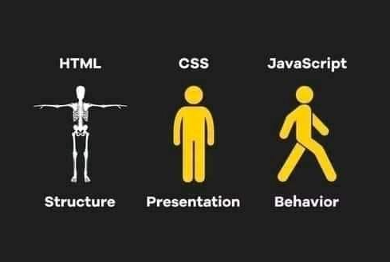

# JavaScript et la programmation

## C'est quoi JavaScript ?

JavaScript (ou JS), langage de programmation créé en 1995

⚠️ ne pas confondre avec le langage Java

https://www.jetbrains.com/fr-fr/lp/devecosystem-2024/#key-takeaways

ℹ️ TypeScript : "JavaScript amélioré", même syntaxe avec des éléments supplémentaires (vu plus tard dans la formation)

Le code JavaScript peut être appliqué :
- par un navigateur web = front-end
- par un ordinateur (un serveur) = back-end (vu plus tard dans la formation)

Dans un navigateur web, JavaScript permet de dynamiser l'affichage web : réagir à des interactions de l'utilisateur (clic, soumission de formulaire, etc) pour notamment adapter l'affichage.

## Langage de programmation

**Programmer** : écrire des instructions pour _un ordinateur_ (une machine, un robot, un outil d'un ordinateur par exemple un navigateur web...) pour qu'il applique un traitement, qu'il produise un résultat

**Langage de programmation** : ce qui permet d'écrire les instructions, avec du vocabulaire, une syntaxe (grammaire), des outils, des briques qu'on va pouvoir assembler... Il y a notamment des outils de base communs à beaucoup de langages (et qu'on va commencer à découvrir aujourd'hui et cette semaine 👀) : variables, conditions, fonctions, boucles...

### Algorithme

**Algorithme** : succession d'étapes à appliquer (un peu comme une recette de cuisine), pour produire quelque chose ou résoudre un problème.

Le **code** est la traduction d'un algorithme dans un langage de programmation.

### Recette pour faire des crêpes ?

- il y a plein de recettes possibles pour faire des crêpes => souvent il y a plusieurs façons de résoudre un problème, **plusieurs algorithmes possibles**
- on peut aussi se procurer des crêpes déjà prêtes 😁 => **on peut utiliser du code qui a été écrit par d'autres développeurs** (encore un sujet vu plus tard dans la formation)
- il y a des façons plus ou moins efficaces d'appliquer une recette (aller 5 fois de suite chercher quelque chose dans le placard au lieu de tout ramener en une seule fois) => **le code peut être écrit de façon plus ou moins performante, plus ou moins "élégante"**

💭 pour le moment, si déjà vous arrivez à obtenir le bon résultat, aucune importance si vous n'avez pas écrit le code de la meilleure façon possible, l'optimisation viendra plus tard.

En fait on optimise peu le code aujourd'hui, notamment pour le web, vu la puissance des machines. En revanche on est obligé d'optimiser si on écrit du code pour un tableau de bord de voiture ou une machine à café.

> un iphone contient un million de fois la quantité de mémoire vive de l’ordinateur de 1969

- avant de faire des crêpes on va réfléchir à quelle recette utiliser, aux contraintes qu'on a (beurre ou huile / crêpes au jambon = sans sucre / ...). Et avant d'appliquer les instructions de la recette on va s'assurer qu'on a tous les ingrédients sous la main
=> **on réfléchit avant d'écrire du code**

Si on applique sans réfléchir ? Oublier les oeufs, faire cuire dans la poêle juste le lait avant d'ajouter les autres ingrédients... 💥 c'est raté, on a un **bug**

**Bug** : quand le résultat du code écrit n'est pas celui qu'on voulait obtenir

💡 En cuisine comme quand on écrit du code, c'est important de **vérifier que chaque étape est correcte avant de passer à l'étape suivante**, pour pouvoir rectifier rapidement et facilement