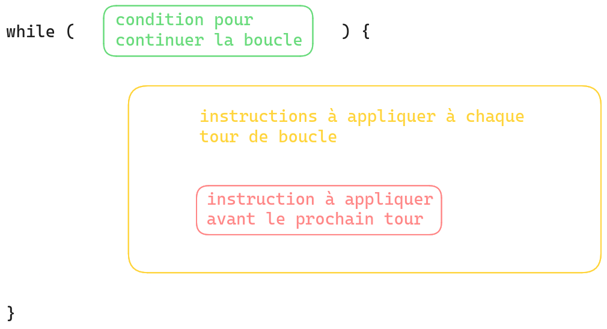
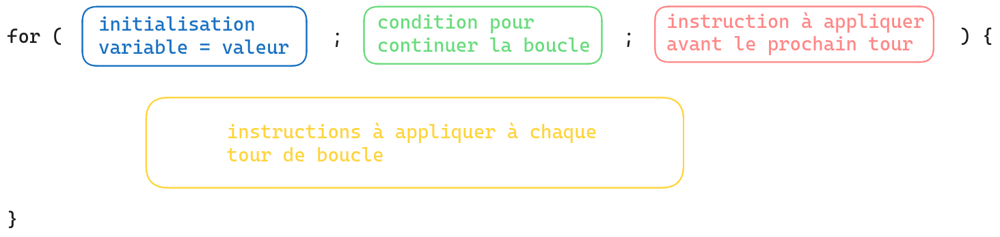

# Les boucles

Permet de répéter un traitement plusieurs fois.

## Répéter un traitement "tant que" telle condition n'est pas atteinte => while


Quand on veut répéter un traitement TANT QUE une condition est vraie ("le joueur n'a pas trouvé la bonne réponse" => boucle while)




### Un exemple de boucle while

objectif : poser la question tant que la bonne réponse n'a pas été donnée

```js
const question = "En quelle année JavaScript a-t-il été inventé ?";
const solution = "1995";

/*
TANT QUE la bonne réponse n'a pas été donnée => isFound === false
FAIRE poser la question
      vérifier la réponse
      stocker le résultat de la validation => stocker dans la variable isFound
*/

// on crée une variable pour stocker l'indicateur de "bonne réponse trouvée"
let isFound = false;

while (isFound === false) {
   const response = prompt(question);

   // comparer la réponse avec la solution
   if (response === solution) {
        alert("Gagné !");

        // c'est la bonne réponse : on change l'indicateur de "bonne réponse trouvée"
        isFound = true;
   } else {
        alert("Perdu !");
   }
}

// Bien vérifier que la condition va devenir non valide à un moment par rapport aux instructions dans le while, sinon boucle infinie
```

#### Un deuxième exemple de boucle while

Objectif : écrire 5 fois "Je réfléchirai avant d'écrire du code"

```js
/*
créer une variable count pour compter les répétitions => 0 comme première valeur
TANT QUE on n'a pas répété 5 fois les instructions => count < 5
FAIRE 
    écrire "Je réfléchirai avant d'écrire du code"
    augmenter count de 1
*/

// créer une variable count pour compter les répétitions
let count = 0;

// boucle : tant que count est strictement inférieur à 5
while (count < 5) {
    // écrire "Je réfléchirai avant d'écrire du code"
    console.log("Je réfléchirai avant d'écrire du code");

    // augmenter count de 1
    count = count + 1;
}
```


## Pour répéter plusieurs fois un traitement (répéter 5 fois, répéter pour chaque question...) => for

Quand on veut répéter un traitement un nombre précis de fois connu à l'avance.


### Boucle for



On peut écrire différemment la boucle while du deuxième exemple :

```js
// Objectif : écrire 5 fois "Je réfléchirai avant d'écrire du code", en utilisant une boucle for

// for (initialisation ; condition de poursuite ; préparation tour suivant)
for ( let count = 0 ; count < 5 ; count = count + 1 ) {
    // écrire "Je réfléchirai avant d'écrire du code"
    console.log("Je réfléchirai avant d'écrire du code");
}
```

🗒️ Il faut bien étudier la valeur initiale et le comparateur :

- `let i = 1 ; i <= 3` => "1 2 3" donc 3 fois
- `let i = 0 ; i <= 3` => "0 1 2 3" donc 4 fois
- `let i = 1 ; i < 3` => "1 2" donc 2 fois
- `let i = 0 ; i < 3` => "0 1 2" donc 3 fois

On peut utiliser le compteur pour une condition par exemple :

```js
for (let counter = 1; counter < 4 ; counter = counter + 1) {
    console.log("Ligne " + counter + " - Je réfléchirai avant d'écrire du code");

    if (counter === 2) {
        console.log("Courage on y est presque");
    }
}

console.log("code après la boucle");
```

Résultat :

```
Ligne 1 - Je réfléchirai avant d'écrire du code
Ligne 2 - Je réfléchirai avant d'écrire du code
Courage on y est presque
Ligne 3 - Je réfléchirai avant d'écrire du code
code après la boucle
```

#### Syntaxes alternatives pour incrémentation

"incrémentation" => augmenter une variable de type number
"affectation" => ranger une valeur dans une variable

```js
let nbCats = 2;

// un chat supplémentaire
nbCats = nbCats + 1;

// on peut aussi écrire en regroupant addition et affectation en une opération
nbCats += 1;
// toto += 8 c'est exactement pareil que toto = toto + 8

// on peut aussi écrire avec ++
nbCats++;
// toto++ c'est exactement pareil que toto = toto + 1
```


Sur une boucle for :

```js
for ( let count = 0 ; count < 5 ; count++ ) {
```

## Répéter un traitement pour chaque élément d'un tableau


On peut utiliser une boucle _for_ en s'appuyant sur les index.

```js
const names = ["Lucie", "Franck", "Phil"];

for (let i = 0; i < 3; i++) {
    console.log("Prénom à l'index " + i + " : " + names[i]);
}
```

> Prénom à l'index 0 : Lucie
> 
> Prénom à l'index 1 : Franck
> 
> Prénom à l'index 2 : Phil


`i++` c'est une façon raccourcie d'écrire `i = i + 1`. Si on a une variable qui s'appelle _nbResults_ et qu'on écrit `nbResults++`, c'est comme si on écrivait `nbResults = nbResults + 1`. 

🗒️ Pour parcourir tous les éléments d'un tableau il faut commencer à zéro et s'arrêter à _taille - 1_ (par exemple avec `< taille`).

Généralement on utilise _length_ pour ne pas avoir à compter soi-même les éléments :

`for (let i = 0; i < names.length; i++)`

## Boucle for spéciale pour les tableaux : for...of 

```js
const users = ["Mélanie", "Pierre", "John", "Marie"];

// for(let i = 0; i < users.length; i++) {
//     console.log("Bonjour " + users[i]);
// }

// quand on veut appliquer des instructions à chaque élément d'un tableau
for (let currentUser of users) {
    console.log("Bonjour " + currentUser);
}
```


On crée une variable qu'on nomme currentUser (on pourrait aussi l'appeler _user_ mais attention avec 2 variables qu ont juste une lettre différente dans leur nom), cette variable sera remplie successivement avec chaque élément du tableau 

https://developer.mozilla.org/en-US/docs/Web/JavaScript/Reference/Statements/for...of

=> pas besoin de créer et faire évoluer une variable pour l'index

## Boucle spéciale pour les objets : for...in

Pour appliquer une opération à toutes les propriétés d'un objet (pas trop utile pour les modules, c'est surtout pour quand l'objet stocke des données)

```js
const object = {
    firstName: 'Pierre',
    age: 25,
    city: 'Paris'
};

for (const property in object) {
    // la variable property est construite automatiquement, elle contiendra successivement chaque propriété de l'objet

    // pour accéder au nom de la clé : property
    // pour accéder à la valeur : ce n'est pas "object.property" parce que sinon ça veut dire aller chercher la clé 'property'. On veut utiliser comme clé le contenu de la variable property, on est obligé d'utiliser la syntaxe avec des crochets => object[property]
  console.log(`la propriété "${property}" a pour valeur "${object[property]}"`);
}
```


## forEach

_forEach_ n'est pas un mot-clé du langage comme _for_ ou _while_, c'est une méthode qui s'applique sur les tableaux (uniquement sur les tableaux) => appliquer une opération sur chaque élément d'un tableau, un peu comme for...of .

On va ranger l'opération dans une définition de fonction.

On fournit la définition de fonction sous forme de callback en argument. Cette callback sera appelée automatiquement pour chaque élément du tableau => la fonction doit donc avoir un paramètre (qu'on nomme comme on veut) pour que la valeur puisse être injectée.


```js
const names = ["Lucie", "Franck", "Phil"];

function printHello(currentName) {
    console.log('Hello ' + currentName);
}

names.forEach(printHello);
// Ce qui va être fait par forEach :
// - printHello("Lucie");
// - printHello("Franck");
// - etc avec tous les éléments du tableau
```

forEach est pratique pour réutiliser un traitement, quand on utilise une fonction nommée :

```js
const names = ["Lucie", "Franck", "Phil"];
const friends = ["David", "Raphaël"];

function printHello(currentName) {
    console.log(`Hello ${currentName}`);
}

names.forEach(printHello);
friends.forEach(printHello);
```

https://developer.mozilla.org/en-US/docs/Web/JavaScript/Reference/Global_Objects/Array/forEach

```js
        capitalCities.forEach(city => {
            <li><a href="/city/<%= city.name.toLowerCase() %>"><%= city.name %></a></li>})
  ```

Ici, pour l'objet <%capitalcities%>, on définit une constante <%city%> qui permet d'appeler <%.name%> dans capital cities

## Les boucles infinies

C'est un problème qu'on peut rencontrer. Si on gère mal la condition de fin, la boucle continue "pour toujours" (le navigateur peut l'arrêter parfois, ou alors ça plante le navigateur).

=> toujours vérifier la "condition de sortie" avant d'appliquer le code

