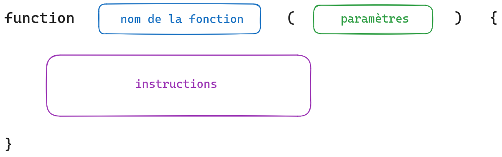

# Fonctions

Imaginons qu'on a pour mission de programmer un robot, qui doit se déplacer dans un bâtiment.

Ce robot doit ouvrir les portes.

Ouvrir une porte c'est un ensemble d'instructions.

_Algorithme_ pour que le robot ouvre une porte :
- se placer devant la porte
- poser la "main" sur la poignée
- appuyer sur la poignée
- tirer
- etc

Pour gérer un trajet du robot à travers le bâtiment il faudra ouvrir plusieurs portes, donc répéter ces instructions à chaque fois.

On peut copier/coller le morceau de code, ça va rendre le code plus long et compliqué. Il faudra se souvenir où commencent et se terminent les instructions pour l'ouverture d'une porte, pas oublier une instruction.

Et si plus tard on doit rajouter une instruction "prendre une photo" à chaque fois qu'on vient d'ouvrir une porte, il faudra reprendre tous les endroits du code dupliqué et ajouter une ligne... Sans oublier des endroits du code où le robot ouvrait une porte...  Galère 😬

Et puis il va nous falloir un traitement pour ouvrir une porte à pousser plutôt que tirer, traitement presque pareil mais pas exactement... 🥵

=> Souvent on a besoin de regrouper un ensemble d'instructions, notamment pour pouvoir réutiliser cet ensemble plusieurs fois, mais aussi pour pouvoir automatiser un traitement en le personnalisant (l'ouverture d'une porte vers l'extérieur / vers l'intérieur)

Pour ça on va utiliser des **fonctions** (un principe très courant dans les langages de programmation, ce n'est pas spécifique à JavaScript).

Une **fonction** : un traitement (un ensemble d'instructions) qu'on peut appliquer plusieurs fois. Ce traitement porte un nom, pour pouvoir l'appliquer facilement.

## Syntaxe

- définir une fonction : **déclaration** d'une fonction, mise en place d'un traitement qu'on pourra ensuite utiliser



Les instructions sont appelées _corps_ de la fonction.

- appliquer le code d'une fonction qu'on a définie : exécution (ou appel) de la fonction


Une fonction a UNE déclaration (qui ne produit pas de résultat), et autant d'exécutions qu'on souhaite.

### Nommer une fonction

- sans espaces, sans points, sans tirets - (underscore _ c'est possible)
- indique ce que fait la fonction (commence souvent par un verbe)
- de préférence en anglais
- en camelCase, en commençant par une minuscule https://fr.wikipedia.org/wiki/Camel_case
- unique (pas d'autre fonction ou de variable qui porte le même nom, et ne pas utiliser les mots-clés du langage)

Exemples : `sayHello`, `displayResultWithColors`, `checkAnswer`

### Premier exemple de fonction (sans paramètres/arguments)

```js
function sayHello() {
  alert("Hello");
}
```
=> on a déclaré un traitement (un ensemble d'instructions) pour dire bonjour, on lui a donné le nom "sayHello" pour pouvoir l'utiliser plus tard

En faisant cette déclaration, aucune alerte ne s'affiche.

```js
sayHello();
```

=> un alert s'affiche


```js
sayHello();
sayHello();
sayHello();
```

=> 3 alert s'affichent

### Paramètres et arguments

Pour personnaliser le traitement, on peut mettre en place un/des _paramètre(s)_.

C'est quand le traitement fait presque toujours pareil, mais avec une information dynamique par exemple, ou avec un comportement légèrement adaptable.

Exemple : on veut dire bonjour en citant le prénom de la personne. On ne va pas créer une fonction pour chaque prénom : sayHelloJohn, sayHelloMarie ... 😆

On va plutôt indiquer que la fonction pour dire bonjour utilise une information qui représente un prénom :

```js
function sayHello(name) {
    alert("Hello " + name);
}
```

On choisit le nom qu'on veut pour les paramètres, avec les mêmes contraintes de nommage que pour les variables. S'il y a plusieurs paramètres, on les sépare avec des virgules.

```js
function sayHelloCompleteName(firstName, lastName) {
    // ici firstName et lastName sont les paramètres de la fonction
    alert("Hello " + firstName + " " + lastName);
}
```

Pour l'exécution des fonctions on fournit une valeur pour chacun des paramètres, dans le même ordre que les paramètres ont été définis. On appelle ces valeurs des arguments.

Exemple avec un seul paramètre :

```js
// on définit une fonction pour dire bonjour en citant un prénom
// ici name est une information nécessaire à la fonction pour appliquer le traitement : un paramètre
function sayHello(name) {
    alert('Hello ' + name);
}

// on applique le traitement contenu dans la fonction, en fournissant une information que la
// fonction utilisera pour son traitement
// si la fonction a un ou des paramètres, il faut fournir au moment de l'exécution les valeurs pour chacun des paramètres : on appelle ces valeurs des arguments
sayHello('Mathieu');
sayHello('Tserisoa');

// si on oublie de fournir un argument, sa valeur sera undefined (valeur spéciale en JS qui indique que quelque chose n'a pas de valeur)
sayHello(); // Hello undefined
```

Exemple avec deux paramètres :

```js
// on définit une fonction pour dire bonjour en citant un prénom
// ici firstName et lastName sont des informations nécessaires à la fonction pour appliquer le traitement : des paramètres
function sayHello(firstName, lastName) {
    alert('Hello ' + firstName + ' ' + lastName);
}

// on applique le traitement contenu dans la fonction
// si la fonction a un ou des paramètres, il faut fournir au moment de l'exécution les valeurs pour chacun des paramètres : on appelle ces valeurs des arguments
sayHello('Harry', 'Potter');

// on peut dire bonjour à qui on veut
sayHello('Hermione', 'Granger');
```

Les paramètres peuvent être de différents types (respecter les types pour les valeurs des arguments) :

```js
// déclaration
function sayHelloWithAge(name, age) {
    alert("Hello " + name + " qui a " + age + " ans");
}

// exécution
sayHelloWithAge("John", 45);
// Hello John qui a 45 ans
sayHelloWithAge("Marie", 61);
// Hello Marie qui a 61 ans

// /!\ code pas pertinent
sayHelloWithAge(61, "Marie");
// Hello 61 qui a Marie ans
```

### Remarque

En fait, on utilisait déjà des fonctions : `alert("Hello")` => on appelle la fonction _alert_ avec "Hello" en argument.

On n'a pas écrit la définition (déclaration) de _alert_, ça fait partie des outils JS.

Pour le cas de `console.log`, c'est aussi une fonction qui fait partie des outils de JS, qui s'appelle `log` et qui est rangée dans un "conteneur" (module, à voir plus tard) qui s'appelle `console`.

### _return_ pour retourner un résultat

2 types de traitements :
- _faire_ quelque chose : ouvrir une porte, afficher un message...
- _produire quelque chose_ : fabriquer un hamburger, obtenir le résultat d'un calcul => on obtient quelque chose à la fin

Faire quelque chose, déjà vu :

```js
function sayHello(name) {
    console.log("Hello " + name);
}
```

Construire quelque chose : une chaîne de caractères qui décrit un hamburger

```js
function makeHamburger(cheese) {
    const result = "pain | " + cheese + " | steak | pain";
    console.log("dans la fonction on a produit : " + result);
}
 
const hamburger = makeHamburger("comté");
console.log("Après l'appel à la fonction on récupère : " + hamburger);

// on essaie d'utiliser la variable qui est créée dans la fonction
console.log(result);
// erreur "result is not defined"
```

Affichage dans la console :
> dans la fonction on a produit : pain | comté | steak | pain
> 
> Après l'appel à la fonction on récupère : undefined

💭 En JavaScript, quand on crée une variable dans une fonction, cette variable n'est pas accessible à l'extérieur de la fonction (portée de let/const : un bloc de code, les `{ }`).

Notre hamburger est resté dans la cuisine, euh dans la fonction 😜 .

On demande à la fonction de "faire sortir" le hamburger, avec le mot-clé `return` suivi de la valeur à retourner

```js
function makeHamburger(cheese) {
    const result = "pain | " + cheese + " | steak | pain";
    console.log("dans la fonction on a construit : " + result);

    // on "fait sortir" le résultat qu'on a produit
    return result;
    // => on retourne la valeur contenue dans la variable

    // on aurait aussi pu retourner directement le hamburger
    // return "pain | " + cheese + " | steak | pain"
}

// on récupère le résultat pour s'en servir
const hamburger = makeHamburger('raclette');
console.log("Hamburger pour midi : " + hamburger);

// on peut aussi se servir directement du résultat produit par une fonction
console.log("On va aller manger ce hamburger : " + makeHamburger('raclette'));

// code inutile, on ne peut pas utiliser le hamburger
makeHamburger('camembert');
```

Note : l'application de _return_ arrête le traitement de la fonction, des instructions qui seraient placées après ne seront pas appliquées

```js
function makeHamburger(cheese) {
    const result = "pain | " + cheese + " | steak | pain";

    // on retourne la valeur de la variable
    return result;

    // le code ici ne sera jamais appliqué
    console.log("jamais affiché");
}
```

On ne peut pas retourner plusieurs choses dans une fonction, sauf si on ruse, par exemple en rangeant dans un tableau et en retournant le tableau.

Pour aller plus loin : il peut y avoir plusieurs instructions return dans une fonction, mais elles ne doivent pas s'appliquer dans le même cas :

```js
function getPrice(age) {
    if (age < 3) {
        return 0;
    } else {
        return 75;
    }
}

const price = getPrice(25);
console.log(price); // 75

const priceChild = getPrice(2);
console.log(priceChild); // 0
```

Si une fonction n'a pas de return et qu'on essaie de récupérer son résultat dans une variable, la variable vaudra _undefined_.

## Valeur par défaut pour un paramètre de fonction

Quand on appelle une fonction, si on ne fournit pas de valeur pour l'un des paramètres, alors il vaudra _undefined_. On peut indiquer une valeur par défaut pour un paramètre, c'est-à-dire une valeur qui sera utilisée automatiquement pour ce paramètre s'il n'a pas de valeur fournie.


```js
function makeHamburger(cheese) {
    const hamburger = "pain | " + cheese + " | steak | pain";


    // on "fait sortir" le résultat, on le retourne
    return hamburger;
}

const hamburger = makeHamburger();
// On n'a pas indiqué quel fromage on veut
console.log(hamburger);
// pain | undefined | steak | pain
```

Si on veut que le fromage soit du comté pour le hamburger de base, et pouvoir préciser un autre fromage si on veut : on va indiquer _comté_ comme valeur par défaut pour le paramètre _cheese_ 

```js
function makeHamburger(cheese = "comté") {
    // si la valeur pour cheese n'a pas été indiquée lors de l'appel de la fonction, alors dans le corps de la fonction cheese vaut "comté" 

    const hamburger = "pain | " + cheese + " | steak | pain";


    // on "fait sortir" le résultat, on le retourne
    return hamburger;
}

// hamburger basique, automatiquement au comté
const hamburgerBasique = makeHamburger();
console.log(hamburgerBasique);
// pain | comté | steak | pain

// hamburger personnalisé, on choisit le fromage
const hamburgerRaclette = makeHamburger('raclette');
console.log(hamburgerRaclette);
// pain | raclette | steak | pain
```

Si on tente d'ajouter un deuxième paramètre pour pouvoir choisir le pain

```js
function makeHamburger(cheese = 'comté', bread) {
    // on produit un hamburger
    const result = bread + " | " + cheese + " | steak | " + bread;

    // et on le "fait sortir" pour l'utiliser en-dehors de la fonction
    return result;
}
 
// code pas correct : on obtient un hamburger avec juste du pain brioché et du steak
const hamburgerBasique = makeHamburger('pain brioché');
console.log(hamburgerBasique);
// undefined | pain brioché | steak | undefined

const hamburgerRaclette = makeHamburger('raclette', 'pain brasserie');
console.log(hamburgerRaclette);
```

On fait en sorte que le pain soit bien le deuxième argument :

```js
const hamburgerBasique = makeHamburger(undefined, 'pain brioché');
console.log(hamburgerBasique);
// pain brioché | comté | steak | pain brioché
```

Pas très pratique de devoir injecter undefined comme argument => généralement on place en dernier les paramètres qui ont une valeur par défaut

```js
// si aucune valeur n'est fournie pour le paramètre cheese, alors on utilise la valeur "comté"
function makeHamburger(bread, cheese = 'comté') {
    // on produit un hamburger
    const result = bread + " | " + cheese + " | steak | " + bread;

    // et on le "fait sortir" pour l'utiliser en-dehors de la fonction
    return result;
}
 
// hamburger basique, automatiquement au comté
const hamburgerBasique = makeHamburger('pain brioché');
console.log(hamburgerBasique);

// hamburger personnalisé, on choisit le fromage
const hamburgerRaclette = makeHamburger('pain brasserie', 'raclette');
console.log(hamburgerRaclette);
```

## fonction fléchées

C'est une autre syntaxe pour les fonctions (plus moderne : ES6).

### fonction anonyme

```js
function(item) {
  return item * 2;
}
```

En fléchée : on enlève le mot "function" et ajouter une => entre les paramètres et le corps de la fonction

```js
(item) => {
  return item * 2;
}
```

### fonction nommée

```js
function multiplyBy2(item) {
  return item * 2;
}
```

```js
// déclaration d'une fonction en utilisant la syntaxe "fonction fléchée" 
const multiplyBy2 = (item) => {
  return item * 2;
}
// => multiplyBy2 c'est une variable qui contient la définition d'une fonction
```

Pour appeler la fonction :

```js
multiplyBy2(4);
```

## Raccourcis

On peut écrire n'importe quelle définition sous forme de fléchée, et on peut parfois écrire "en plus court", notamment :

- si un seul paramètre, on peut ne pas mettre de parenthèses

```js
const multiplyBy2 = item => {
  return item * 2;
}
```

- si la seule instruction est un return, on peut faire un "return implicite" (la fonction retourne quelque chose sans qu'on écrive le mot return) : enlever le mot return et les accolades

```js
// déclaration de fonction
const multiplyBy2 = item => item * 2;

// utilisation de la fonction
const result = multiplyBy2(4); // 8
```

/!\ ne pas abuser de ce return implicite

```js
const sayHello = (name) => console.log('Hello ' +  name);
```

Si on appelle `sayHello('Mélanie');` ça applique bien le traitement. Mais dans d'autres cas (avancés) ça pourrait être source de bugs, parce que là c'est comme si on avait écrit :

```js
function sayHello(name) {
    return console.log('Hello ' +  name);
}
// on retourne undefined, pas très utile
```


