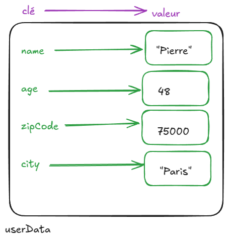

 Introduction

Hier on a découvert les tableaux, une façon de stocker _plusieurs informations dans une seule variable_, avec une case par information.

Chaque information d'un tableau est repérée par un index numérique : 0, 1, 2 etc.

On a par exemple stocké des prénoms dans un tableau => le stockage en tableau est très pertinent pour stocker des informations homogènes (toutes de la même "catégorie") : des prénoms, des noms de fruits, ...

Le tableau n'est pas très pertinent pour stocker un ensemble d'informations non homogènes, par exemple un prénom et un âge, un nom de ville etc.

```js
const userData = ["Pierre", 48, 75000, "Paris"];

// on va s'embêter avec des index, devoir se souvenir que l'index 2 correspond au code postal, l'index 3 c'est le nom de la ville
console.log("code postal : " + userData[2] + ", ville : " + userData[3]);
// code postal : 75000, ville : Paris

// et on risque de faire des erreurs, parce que les index n'ont pas de "sens", c'est juste des nombres
console.log("Prénom : " + userData[1]);
// Prénom : 48
```

Ce qui serait pratique c'est d'avoir des _index_ qui auraient du sens (comme des noms de variables), plutôt que des nombres...



# Objet

En JavaScript un **objet** (_object_ en anglais) est une façon de stocker plusieurs informations dans une seule variable, en associant à chaque information une _clé_. C'est un ensemble de couples clé/valeur.

## Création d'un objet

```js
const userData = {
    // clé: valeur
    name: 'Pierre', // string
    // name est une clé, "Pierre" est la valeur associée à cette clé

    age: 48, // number
    zipCode: 75000,
    city: 'Paris'
};
console.log(userData);
```

/!\ les accolades d'un objet ne représentent pas un bloc de code, il n'y a pas d'histoire de portée des variables (on n'a pas de création de variables dans un objet)

Chaque information (couple clé-valeur) d'un objet est appelée une _propriété_ (_property_ en anglais).

```js
const userData = { name: 'Pierre', age: 48 /* etc */};
// => c'est techniquement possible, mais moins pratique pour la compréhension
```

## Accéder à une information dans un objet

Pour accéder à une information (une valeur), on doit impérativement utiliser sa clé.

Deux syntaxes :

```js
// 1- nom de l'objet POINT nom de la propriété
const cityOfUser = userData.city;
console.log(cityOfUser); // Paris

// 2- nom de la propriété entre crochets (pas un nombre)
const cityOfUser = userData["city"];
```

Les deux syntaxes peuvent être utilisées, la première évite de confondre _objets_ et _tableaux_ en JS, la deuxième permet d'utiliser une clé contenue dans une variable (en ne mettant pas de guillemets).


Et si on essaie de récupérer un nom de propriété qui n'existe pas ?

C'est comme quand on "déborde" des tableaux => _undefined_

```js
console.log(userData.toto); // undefined

// /!\ attention aux majuscules/minuscules
console.log(userData.zipcode); // undefined
console.log(userData.zipCode); // 75000
```

## Modifier une propriété d'un objet

Là aussi, il faudra passer par la clé, par le nom de la propriété à modifier.

```js
const userData = {
    name: "Pierre",
    age: 48,
};
console.log(userData); // {name: 'Pierre', age: 48}

// on peut utiliser les deux syntaxes permettant d'accéder aux valeurs des propriétés
userData.age = 49;
console.log(userData); // {name: 'Pierre', age: 49}

userData["age"] = 50;
console.log(userData); // {name: 'Pierre', age: 50}

// Comme pour les tableaux, `const` n'interdit pas de modifier des informations qui sont dans un objet ou d'en ajouter, ça interdit uniquement le REMPLACEMENT de l'objet complet par un autre
userData = {
    favoriteFood: "hamburger",
    favoriteMovie: "Avatar"
};
// Erreur : Assignment to constant variable
```


Essais supplémentaires :
```js
    userData.job = "développeur web";
    console.log(userData); // {name: 'Pierre', age: 49, job: 'développeur web'}

    userData["eyeColor"] = "bleu";
    console.log(userData); // {name: 'Pierre', age: 49, job: 'développeur web', eyeColor: 'bleu'}
```

=> pour ajouter une information dans un objet, il suffit d'utiliser un nom de propriété qui n'est pas déjà présent dans l'objet.

## Les types possibles pour les propriétés d'un objet

```js
const userData = {
    name: "Pierre",
    age: 48,
    // une propriété qui est un objet (pour regrouper des informations)
    address: {
        zipCode: 75000,
        city: "Paris"
    },
    // une propriété qui est un booléen
    isOnHoliday: false,
    // une propriété qui est un tableau
    children: ["Elodie", "Manon"]
};

// comment récupérer la ville ?
console.log("La ville est : " + userData.address.city); // La ville est : Paris

// comment récupérer le premier enfant ?
console.log("Le premier enfant s'appelle " + userData.children[0]); // Le premier enfant s'appelle Elodie
```

On peut aussi avoir une fonction dans une propriété : on appelle cette fonction une _méthode_ (method en anglais).

En fait... `console.log` c'est l'appel à la méthode _log_ d'un objet qui s'appelle _console_ (qui a été créé par le navigateur automatiquement, pas par nous).

Il y a d'autres méthodes dans l'objet console : table (pour afficher un tableau), clear (pour vider la console)...

## Module

"Gérer la voiture" :
- une carte grise (un document)
- un numéro d'immatriculation (une information)
- l'amener au contrôle technique (une liste d'intructions : prendre rendez-vous ...)

Un module, ça serait le regroupement de tout ça dans un objet. Il pourrait y avoir d'autre modules : "gérer la maison" par exemple.

Un module pour chaque "type de chose" à gérer dans notre application.

Exemple de module pour gérer un jeu (jeu de la fourchette) :

```js
// un module
const game = {
    // ---- des informations
    nbAttempts: 0,
    userName: 'Pierre',
    hints: [],

    // ---- des traitements => des méthodes
    // affichage des indices
    printHints: function() {
        for (let i = 0; i < game.hints.length; i++) {
            console.log(game.hints[i]);
        }
        // note : pour accéder à une information de l'objet : nomObjet.nomPropriété => game.hints
    },

    // génération d'un nombre aléatoire
    buildSecretNumber: function(max) {
        return Math.round(Math.random() * max);
    }
};

const secretNumber = game.buildSecretNumber();

// ..... d'autres instructions
else {
    game.printHints();
}
```

Tous les objets ne sont pas des modules (c'est le rôle de l'objet qui fait qu'on l'appelle "module").

Quand on a une application simple ("gérer un jeu" et pas d'autres choses à gérer, genre messagerie instantanée), on peut appeler le module _app_.

```js
const app = {
    init: function() {
        // créer la grille et le formulaire
    }

    // etc
};

// on génère tout l'affichage
app.init();
```


Math.random / Math.round => Math c'est un module (contenu dans le navigateur) avec tout ce qui concerne les opérations mathématiques. console c'est aussi un module : tout ce qui concerne l'affichage dans la console (méthodes log, table, ....)
