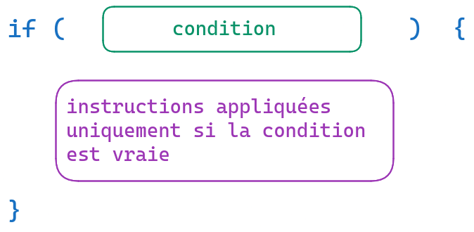

# Conditions

Pour appliquer des instructions ou non, selon le contexte (selon "des conditions").

## if / else

_if_ et _else_ sont des mots-clés utilisés dans beaucoup de langages de programmation pour appliquer des instructions de façon conditionnelles.

On peut ainsi appliquer des instructions uniquement dans un cas. On peut aussi appliquer des instructions différentes selon plusieurs cas.


Pour appliquer une instruction dans un cas et rien dans l'autre cas :




## Ecriture de la condition

Une **condition** c'est la _comparaison_ avec une _valeur_.

Comparaisons :
- strictement inférieur `<`
- inférieur ou égal `<=`
- strictement supérieur `>`
- supérieur ou égal `>=`
- identique `===`
- différent `!==`

`(age < 3)` => vrai pour 1, 2, faux pour 3 et 4

`(age <= 3)` => vrai pour 1, 2 et 3, faux pour 4

`if (name === "Mélanie")` => vrai pour "Mélanie", faux pour "Melanie", "Patrick", etc

"différent de 5" =>

`if (tailleFamille !== 5) ` => vrai pour 1, 2, 3, 4, 6, etc, et faux pour 5

La valeur peut notamment être un entier, une chaîne de caractères. Il faut que l'opérateur soit cohérent avec la valeur : pas de `if (age < "Patrick") `.

A partir de 17 ans on peut passer le permis de conduire

```js
if (age >= 17) {
    console.log("OK pour passer le permis de conduire");
}
```

### Identique / différent en JS

Pourquoi ne pas écrire avec un seul `=` ? Parce que `=` c'est pour ranger une valeur dans une variable.

```js
let name = "Nicole";

// /!\ code avec un bug
if (name = "Mélanie") {
    console.log("Coucou Mélanie !");
}
```

=> affiche "Coucou Mélanie", et la variable _name_ contient maintenant _Mélanie_. On a fait une affectation et pas une condition.

Et `==` ? Ca existe, ça permet de faire une comparaison approximative, on peut comparer des choses de types différents (_string_ avec _number_ par exemple), mais ça produit des résultats surprenants.

- `0 == "0"` => vrai (ça peut servir)
- `true == "true"` => faux (surprenant)
- `false == "0"` => vrai (surprenant)
  
`==` ça peut parfois servir quand on est expérimenté, mais nous on va toujours utiliser `===`.

Avec `===`, si les deux valeurs ne sont pas du même type, la comparaison sera fausse.

- `4 === "4"` => faux, car les types sont différents
- `4 === 4` => vrai
- `"4" === "4"` => vrai
- `4 === 5` => faux
- `"4" === "5"` => faux


Pour une comparaison "_différent de_", on remplace le premier `=` par un `!`.

```js
// on a une variable fruit qui contient un nom de fruit

if (fruit !== "kiwi") {
    console.log("OK, je suis pas allergique");
}
```

### Exemple

```js
const ageOfCustomer = 2;

/*
SI l'age est inférieur à 3
ALORS le tarif est 0 euro
SINON le tarif est 75 euros
*/

if (ageOfCustomer < 3) {
    // condition vraie, age est inférieur à 3
    console.log('tarif : 0 euro');
} else {
    console.log('tarif : 75 euro');
}

// => affiche 'tarif : 0 euro'
```

```js
const ageOfCustomer = 15;

if (ageOfCustomer < 3) {
    // condition vraie, age est inférieur à 3
    console.log('tarif : 0 euro');
} else {
    console.log('tarif : 75 euro');
}

// => affiche 'tarif : 75 euro'
```


